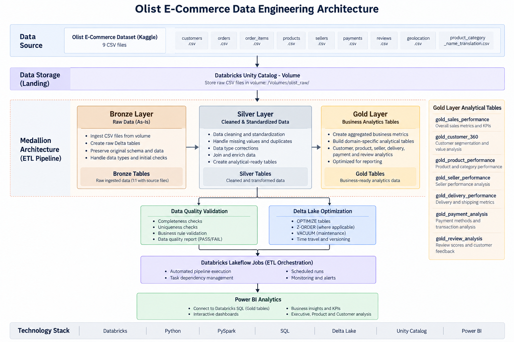

# Olist E-Commerce Data Engineering & Analytics

An end-to-end data engineering and analytics project built using Databricks, PySpark, SQL, Delta Lake, Unity Catalog, GitHub, and Power BI.

The project transforms raw Brazilian e-commerce data into cleaned, validated, business-ready analytical datasets using a Medallion Architecture and presents the resulting insights through interactive Power BI dashboards.

---

## Project Overview

This project implements a complete data engineering pipeline for the Olist Brazilian E-Commerce Public Dataset.

The pipeline integrates multiple e-commerce datasets covering:

- Customers
- Orders
- Order Items
- Payments
- Reviews
- Products
- Sellers
- Geolocation
- Product Category Translation

The solution uses Databricks to ingest, transform, validate, optimize, and orchestrate the data before exposing the Gold layer to Power BI for analytics.

---

## Architecture



### Data Flow

```text
Olist Brazilian E-Commerce Dataset
              |
              v
       Raw CSV Files
              |
              v
   Unity Catalog Managed Volume
              |
              v
        Bronze Layer
        Raw Delta Tables
              |
              v
        Silver Layer
   Cleaned & Transformed Data
              |
              v
          Gold Layer
     Business-Ready Tables
              |
              +----------------------+
              |                      |
              v                      v
      Data Quality Checks     Delta Optimization
              |                      |
              +----------+-----------+
                         |
                         v
                      Power BI
                     Dashboards
