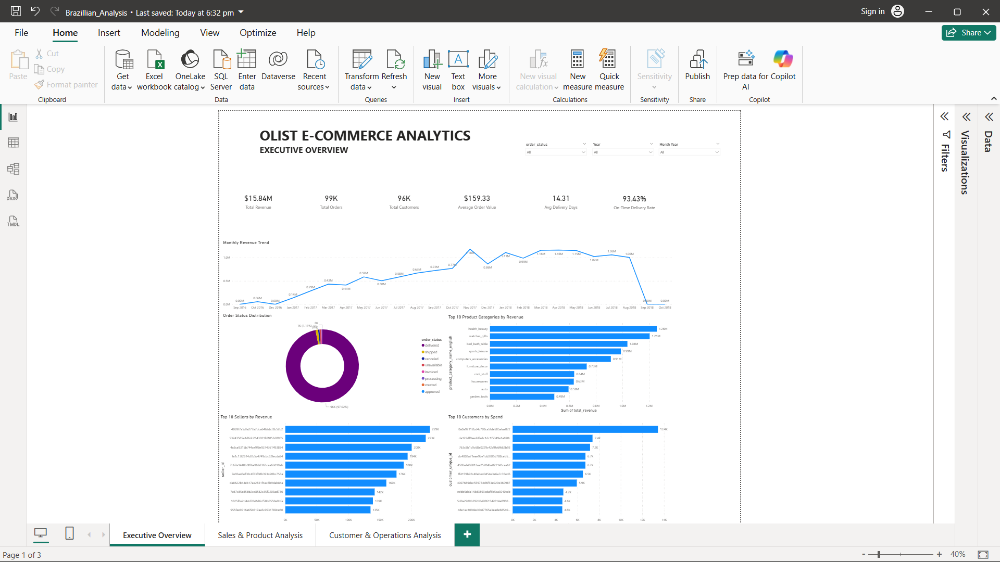
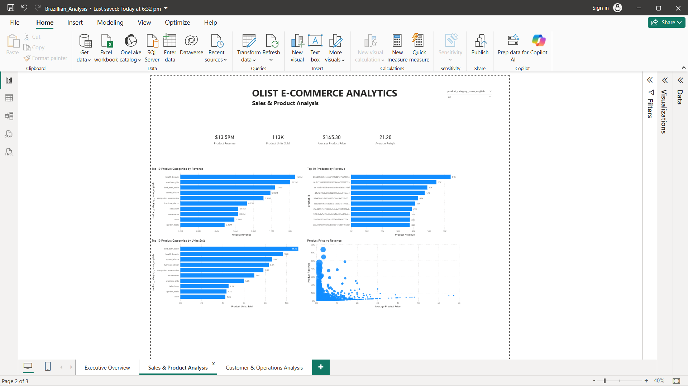
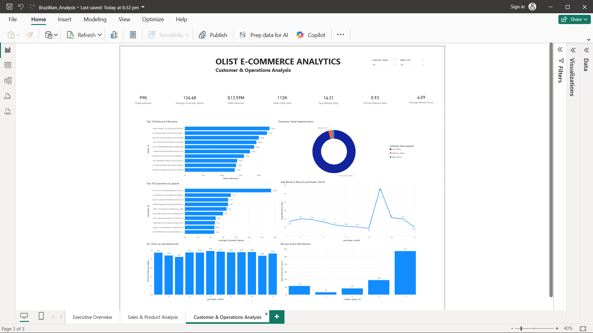

# Power BI Analytics

This folder contains the Power BI dashboard screenshots created from the Gold layer of the Olist E-Commerce Data Engineering project.

The dashboards provide business analysis across sales, products, customers, sellers, deliveries, and reviews.

---

## Dashboard Pages

### 1. Executive Overview

Provides a high-level view of the e-commerce business.

Key KPIs:

- Total Revenue
- Total Orders
- Total Customers
- Average Order Value
- Average Delivery Days
- On-Time Delivery Rate

Key visualizations:

- Monthly Revenue Trend
- Order Status Distribution
- Top Product Categories by Revenue
- Top Sellers by Revenue
- Top Customers by Spend

---

### 2. Sales & Product Analysis

Focuses on product and sales performance.

Key metrics:

- Product Revenue
- Product Units Sold
- Average Product Price
- Average Freight

Key visualizations:

- Top Product Categories by Revenue
- Top Products by Revenue
- Top Product Categories by Units Sold
- Product Price vs Revenue

---

### 3. Customer & Operations Analysis

Focuses on customer behavior and operational performance.

Key metrics:

- Total Customers
- Average Customer Spend
- Seller Revenue
- Seller Units Sold
- Average Delivery Days
- On-Time Delivery Rate
- Average Review Score

Key visualizations:

- Top Sellers by Revenue
- Customer Value Segmentation
- Top Customers by Spend
- Average Delivery Days
- On-Time vs Late Deliveries
- Review Score Distribution

